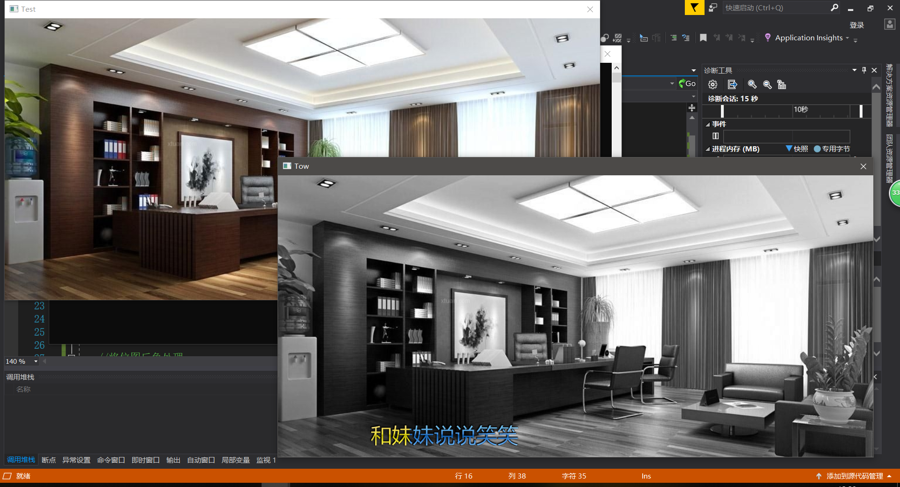
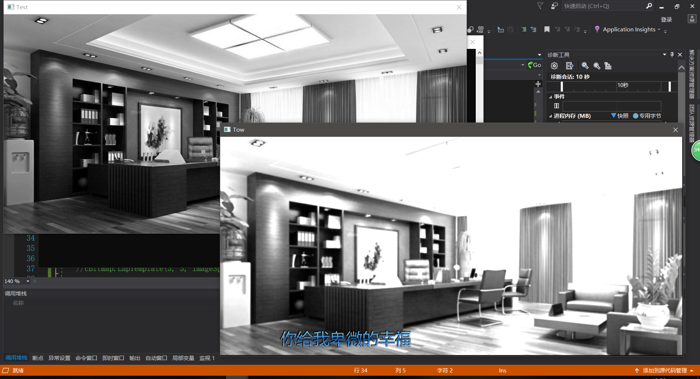
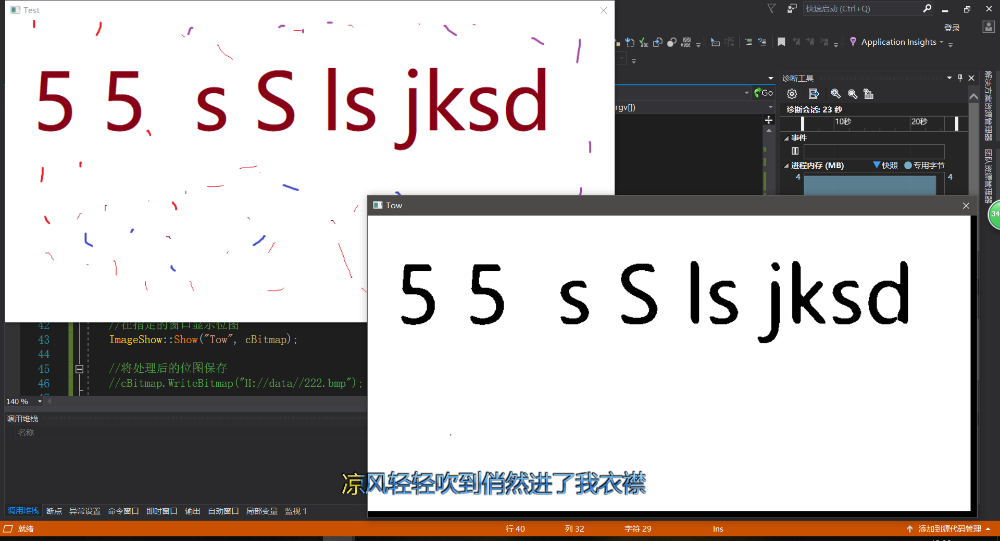
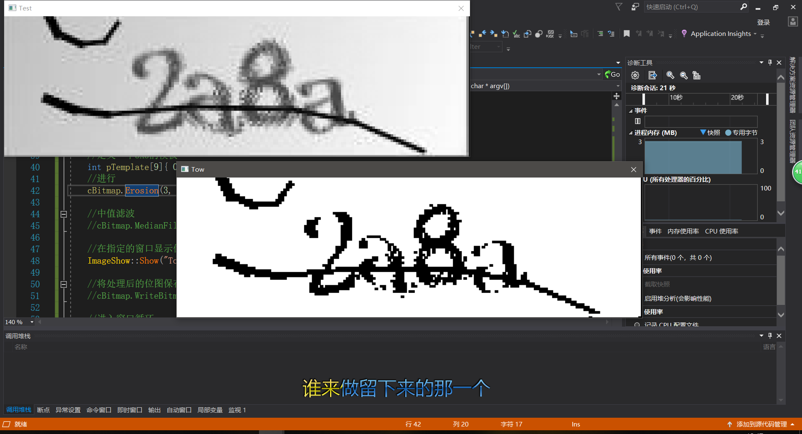

## 项目简介
C++实现位图处理库

## 实现功能
* **平移** 
* **缩放** 
* **镜像** 
* **旋转** 
* **灰度** 
* **二值** 
* **平滑**
* **锐化**
* **腐蚀** 
* **膨胀** 
* **.......** 

## 项目后续
支持Png/Jpg等常用图片格式

## 效果截图
<h1 align="center">
	
	
	
	
	
	 
</h1>

[1](https://i.ibb.co/RPmXZJc/5.png)

[2](https://i.ibb.co/DG7SG1R/3.png)

[3](https://i.ibb.co/P1N8hXD/2.png)
